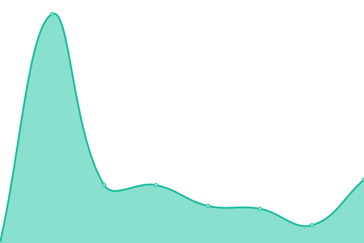
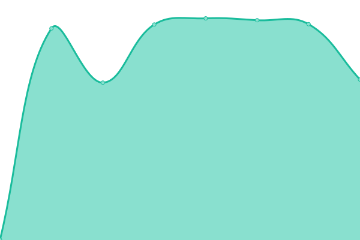
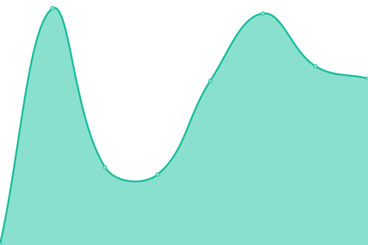
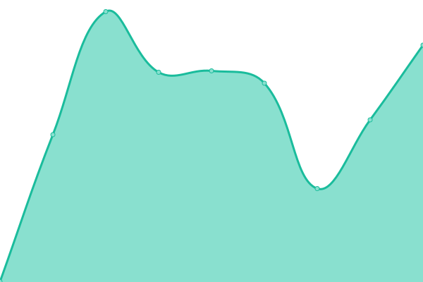

# [📈 Live Status](https://demo.upptime.js.org): <!--live status--> **🟧 Partial outage**

This repository contains the open-source uptime monitor and status page for [Upptime](https://upptime.js.org), powered by [Upptime](https://github.com/upptime/upptime).

With [Upptime](https://upptime.js.org), you can get your own unlimited and free uptime monitor and status page, powered entirely by a GitHub repository. We use [Issues](https://github.com/upptime/upptime/issues) as incident reports, [Actions](https://github.com/nexmoe/upptime/actions) as uptime monitors, and [Pages](https://demo.upptime.js.org) for the status page.

<!--start: status pages-->
<!-- This summary is generated by Upptime (https://github.com/upptime/upptime) -->
<!-- Do not edit this manually, your changes will be overwritten -->
<!-- prettier-ignore -->
| URL | Status | History | Response Time | Uptime |
| --- | ------ | ------- | ------------- | ------ |
|  [Nexmoe](https://nexmoe.com) | 🟥 Down | [nexmoe.yml](https://github.com/nexmoe/upptime/commits/HEAD/history/nexmoe.yml) | 

 708ms
     
 | 

<a href="https://status.nexmoe.com/history/nexmoe">99.22%</a>
    

|  [Shu - Homepage](https://xiaoshuapp.com) | 🟥 Down | [shu-homepage.yml](https://github.com/nexmoe/upptime/commits/HEAD/history/shu-homepage.yml) | 

 479ms
     
 | 

<a href="https://status.nexmoe.com/history/shu-homepage">99.23%</a>
    

|  [BoTab - Homepage](https://botab.net) | 🟩 Up | [bo-tab-homepage.yml](https://github.com/nexmoe/upptime/commits/HEAD/history/bo-tab-homepage.yml) | 

 246ms
     
 | 

<a href="https://status.nexmoe.com/history/bo-tab-homepage">100.00%</a>
    

|  [VidBee](https://vidbee.org) | 🟩 Up | [vid-bee.yml](https://github.com/nexmoe/upptime/commits/HEAD/history/vid-bee.yml) | 

 257ms
     
 | 

<a href="https://status.nexmoe.com/history/vid-bee">100.00%</a>
    

|  [LM Speed](https://lmspeed.net) | 🟩 Up | [lm-speed.yml](https://github.com/nexmoe/upptime/commits/HEAD/history/lm-speed.yml) | 

 272ms
     
 | 

<a href="https://status.nexmoe.com/history/lm-speed">100.00%</a>
    

|  [GEO Checker](https://geochecker.net) | 🟩 Up | [geo-checker.yml](https://github.com/nexmoe/upptime/commits/HEAD/history/geo-checker.yml) | 

 299ms
     
 | 

<a href="https://status.nexmoe.com/history/geo-checker">100.00%</a>
    

|  [VidVerse](https://vidverse.net) | 🟩 Up | [vid-verse.yml](https://github.com/nexmoe/upptime/commits/HEAD/history/vid-verse.yml) | 

 273ms
     
 | 

<a href="https://status.nexmoe.com/history/vid-verse">100.00%</a>
    

<!--end: status pages-->

[**Visit our status website →**](https://demo.upptime.js.org)

## 📄 License

- Powered by: [Upptime](https://github.com/upptime/upptime)
- Code: [MIT](./LICENSE) © [Anand Chowdhary](https://anandchowdhary.com), supported by [Pabio](https://pabio.com)
- Data in the `./history` directory: [Open Database License](https://opendatacommons.org/licenses/odbl/1-0/)
