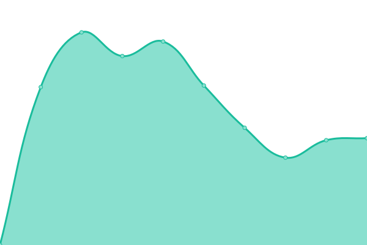
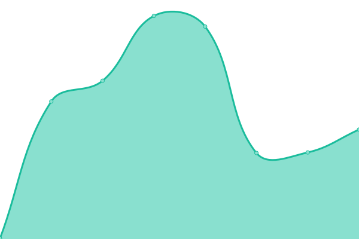
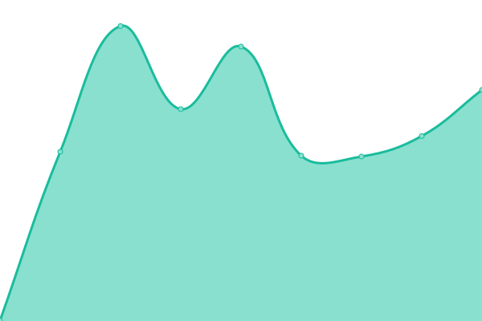
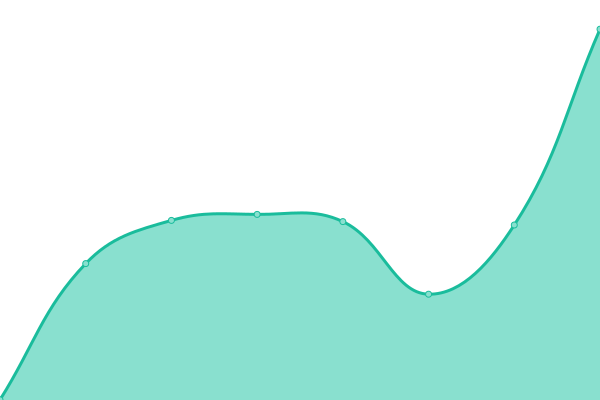
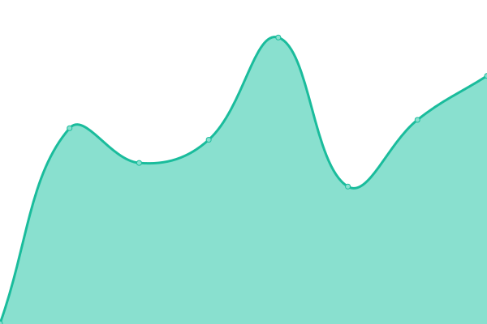
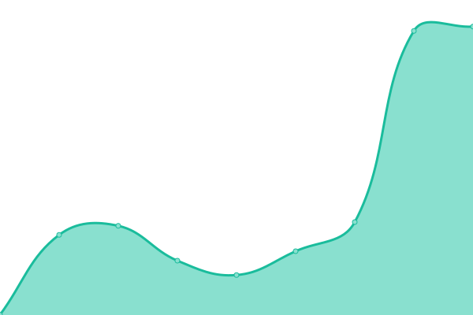
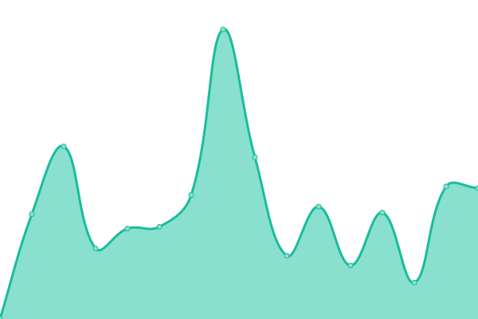

# [📈 Live Status](https://demo.upptime.js.org): <!--live status--> **🟧 Partial outage**

This repository contains the open-source uptime monitor and status page for [Upptime](https://upptime.js.org), powered by [Upptime](https://github.com/upptime/upptime).

With [Upptime](https://upptime.js.org), you can get your own unlimited and free uptime monitor and status page, powered entirely by a GitHub repository. We use [Issues](https://github.com/upptime/upptime/issues) as incident reports, [Actions](https://github.com/nexmoe/upptime/actions) as uptime monitors, and [Pages](https://demo.upptime.js.org) for the status page.

<!--start: status pages-->
<!-- This summary is generated by Upptime (https://github.com/upptime/upptime) -->
<!-- Do not edit this manually, your changes will be overwritten -->
<!-- prettier-ignore -->
| URL | Status | History | Response Time | Uptime |
| --- | ------ | ------- | ------------- | ------ |
|  [Nexmoe - Space](https://i.nexmoe.com) | 🟥 Down | [nexmoe-space.yml](https://github.com/nexmoe/upptime/commits/HEAD/history/nexmoe-space.yml) | 

 0ms
     
 | 

<a href="https://nexmoe.github.io/upptime/history/nexmoe-space">0.00%</a>
    

|  [Nexmoe - Blog](https://nexmoe.com) | 🟩 Up | [nexmoe-blog.yml](https://github.com/nexmoe/upptime/commits/HEAD/history/nexmoe-blog.yml) | 

 165ms
     
 | 

<a href="https://nexmoe.github.io/upptime/history/nexmoe-blog">100.00%</a>
    

|  [Shu - Appwrite](https://aw.xiaoshuapp.com) | 🟩 Up | [shu-appwrite.yml](https://github.com/nexmoe/upptime/commits/HEAD/history/shu-appwrite.yml) | 

 855ms
     
 | 

<a href="https://nexmoe.github.io/upptime/history/shu-appwrite">100.00%</a>
    

|  [Shu - Homepage](https://xiaoshuapp.com) | 🟩 Up | [shu-homepage.yml](https://github.com/nexmoe/upptime/commits/HEAD/history/shu-homepage.yml) | 

 202ms
     
 | 

<a href="https://nexmoe.github.io/upptime/history/shu-homepage">100.00%</a>
    

|  [Shu - Lib](https://lib.xiaoshuapp.com) | 🟥 Down | [shu-lib.yml](https://github.com/nexmoe/upptime/commits/HEAD/history/shu-lib.yml) | 

 0ms
     
 | 

<a href="https://nexmoe.github.io/upptime/history/shu-lib">0.00%</a>
    

|  [Shu - Web](https://pro.xiaoshuapp.com) | 🟩 Up | [shu-web.yml](https://github.com/nexmoe/upptime/commits/HEAD/history/shu-web.yml) | 

 239ms
     
 | 

<a href="https://nexmoe.github.io/upptime/history/shu-web">100.00%</a>
    

|  [RoamingCloud](https://roam.mixcm.com) | 🟩 Up | [roaming-cloud.yml](https://github.com/nexmoe/upptime/commits/HEAD/history/roaming-cloud.yml) | 

 1182ms
     
 | 

<a href="https://nexmoe.github.io/upptime/history/roaming-cloud">100.00%</a>
    

|  [BoTab - Homepage](https://botab.net) | 🟩 Up | [bo-tab-homepage.yml](https://github.com/nexmoe/upptime/commits/HEAD/history/bo-tab-homepage.yml) | 

 184ms
     
 | 

<a href="https://nexmoe.github.io/upptime/history/bo-tab-homepage">100.00%</a>
    

|  [GJ - Homepage - Funasr](https://paraformer-admin-funasr.550w.run) | 🟩 Up | [gj-homepage-funasr.yml](https://github.com/nexmoe/upptime/commits/HEAD/history/gj-homepage-funasr.yml) | 

 1347ms
     
 | 

<a href="https://nexmoe.github.io/upptime/history/gj-homepage-funasr">100.00%</a>
    

<!--end: status pages-->

[**Visit our status website →**](https://demo.upptime.js.org)

## 📄 License

- Powered by: [Upptime](https://github.com/upptime/upptime)
- Code: [MIT](./LICENSE) © [Anand Chowdhary](https://anandchowdhary.com), supported by [Pabio](https://pabio.com)
- Data in the `./history` directory: [Open Database License](https://opendatacommons.org/licenses/odbl/1-0/)
